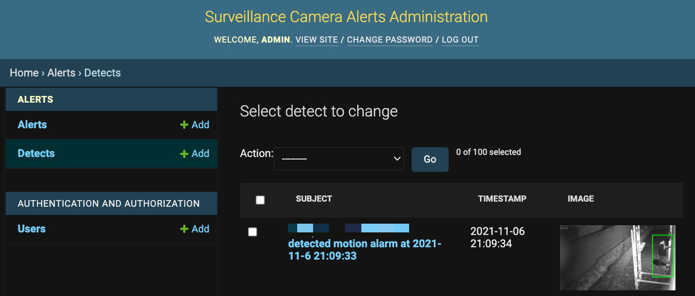

# Surveillance Camera Alerts Server 

This is a Python3 Django web service for reviewing and administrating motion alerts of surveillance cameras from a local SQLIte3 database. 

The alert images are captured by dedicated mail and detect servers within the local network and stored into the local database. This way the surveillance alert images will be stored within your own local network.

Should you want to review the alerts from outside of your local network, you can set up a secure VPN tunnel to access this web service from your mobile device.



This example is made on linux distro Lubuntu 20.04.

## Setup

Install the python3, if not done already.

After cloning this repo, do the following in the project root folder:

Create the virtual environment, activate it and install the dependencies:

```
python3 -m venv .venv
source .venv/bin/activate
python3 -m pip install -r requirements.txt
```

## Prerequisites

### SQLite3 database

An SQLite3 database called **alerts.sqlite3** must be available in a shared folder
being accessable by this cams Django web service and the mail and detect services.
Located e.g. in /home/**user**/db. 

Django will use the **db** folder in the project root to store user etc. data in **db.sqlite3** database.

**NOTE!** If you run this on Apache2 server, the above folders and the database files must have the owner and group set to www-data with file attributes set to 775.

To limit the records on **alerts_alert** and **alerts_detect** table, create the following triggers:

```
CREATE TRIGGER delete_alarms AFTER INSERT ON alerts_alert
    BEGIN
      DELETE FROM alerts_alert WHERE id IN (SELECT id FROM alerts_alert ORDER BY id DESC LIMIT -1 OFFSET 1000);
    END
```
```
CREATE TRIGGER delete_detect AFTER INSERT ON alerts_detect
    BEGIN
      DELETE FROM alerts_detect WHERE id IN (SELECT id FROM alerts_detect ORDER BY id DESC LIMIT -1 OFFSET 1000);
    END
```

### Mail and Detect Services

The mail and detect services must be running prior to starting this cams service.

The mail service is an inbound e-mail service intended to receive e-mail alerts
from the surveillance cameras within the local network. The captured images are then
stored into a table called **alerts_alert** in the SQLite3 database **alerts.sqlite3**.

The detect service is polling a folder for e-mail attachments i.e. images captures
by the surveillance cameras and using Artificial intelligence (AI) to detech people in the images.
Those images are then stored into a table called **alerts_detect** in the SQLite3 database
**alerts.sqlite3**.

## Configuration

### Django settings

Create an environment variable SECRET_KEY into .env file in the project root
```
SECRET_KEY='<django-secret-key>'
```

Django settings must be maintained in the cams/cams/settings.py file for the
following parameters:

```
from decouple import config
SECRET_KEY = config('SECRET_KEY')

ALLOWED_HOSTS = ['localhost','127.0.0.1','192.168.1.100']

DATABASES = {
    'default': {
        'ENGINE': 'django.db.backends.sqlite3',
        'NAME': BASE_DIR / 'db/db.sqlite3',
    },
        'alerts': {
        'ENGINE': 'django.db.backends.sqlite3',
        'NAME': '/home/<user>/db/alerts.sqlite3',
    },
        'detects': {
        'ENGINE': 'django.db.backends.sqlite3',
        'NAME': '/home/<user>/db/alerts.sqlite3',
    }
}
```
## Run migrations and create a Django super user 

In the project root folder 'cams':
```
python3 manage.py makemigrations
python3 manage.py migrate
python3 manage.py createsuperuser
```

## Run web service manually in development

In the project root folder 'cams':
```
source .venv/bin/activate
python3 manage.py runserver <ip>:<port> e.g. 192.168.1.100:8000
```

## Deploy as Apache2 Web Server

Apache2 must be installed see https://linuxhint.com/install_apache_web_server_ubuntu/
and firewall configured.

### Configure /etc/apache2/sites-available/000-default.conf by adding the following:

```
Alias /static /home/<user>/cams/static
<Directory /home/<user>/cams/static>
        Require all granted
</Directory>

<Directory /home/<user>/cams/cams>
        <Files wsgi.py>
                Require all granted
        </Files>
</Directory>

WSGIDaemonProcess cams python-path=/home/<user>/cams python-home=/home/<user>/cams/.venv
WSGIProcessGroup cams
WSGIScriptAlias / /home/<user>/cams/cams/wsgi.py
```

### Activate virtual host configuration file and restart apache2 service

```
sudo a2ensite 000-default.conf
sudo systemctl restart apache2
```
